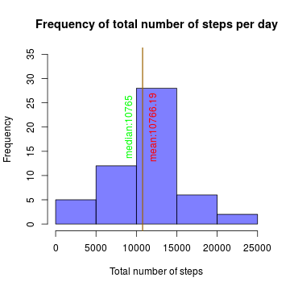
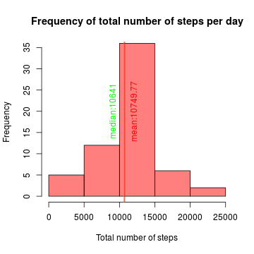
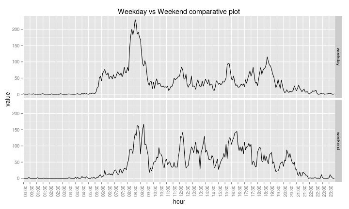

# Reproducible Research: Peer Assessment 1


## Loading and preprocessing the data

Let see if the file is in the directory, unzip it if needed, then load the data

```r
if (any(file.exists("activity.csv", "activity.zip"))) {
    
    # Unzipping file if needed
    if (!file.exists("activity.csv")) {
        unzip("activity.zip")
    }
    
    # Reading data from file
    data <- read.table("activity.csv", header = TRUE, sep = ",")
}
```


## What is mean total number of steps taken per day?
For this part of the assignment we are asked to make a histogram of the total number of steps taken each day, we can ignore the missing values in the dataset.
Let's first create a vector with the total number of steps taken each day:

```r
# tot: total number of steps taken each day
tot <- tapply(data$steps, data$date, sum)
```

Now we can plot the histogram:

```r
# plotting the histogram whith default breaks
hist(tot, col = rgb(0, 0, 1, 0.5), main = "Frequency of total number of steps per day", 
    xlab = "Total number of steps", ylab = "Frequency", ylim = c(0, 35))
```

 

Now let's calculate and report the mean and median total number of steps taken per day

```r
# calculating the mean of tot: the vector of the total number of steps per
# day, ignoring NA's
meantot <- mean(tot, na.rm = TRUE)
print(paste("The mean of the distribution is", round(meantot, 2), sep = ": "))
```

```
## [1] "The mean of the distribution is: 10766.19"
```

```r
# calculating the median of tot: the vector of the total number of steps per
# day, ignoring NA's
mediantot <- median(tot, na.rm = TRUE)
print(paste("The median of the distribution is", mediantot, sep = ": "))
```

```
## [1] "The median of the distribution is: 10765"
```

Now let's report the median and the mean on the histogram plot

```r
# Reporting results on the histogram
hist(tot, col = rgb(0, 0, 1, 0.5), main = "Frequency of total number of steps per day", 
    xlab = "Total number of steps", ylab = "Frequency", ylim = c(0, 35))
# adding mean and median
abline(v = c(mediantot, meantot), col = c("green", "red"))
text(9000, 20, paste("median", mediantot, sep = ":"), col = "green", srt = 90)
text(12000, 20, paste("mean", round(meantot, 2), sep = ":"), col = "red", srt = 90)
```

 


As it can be observed the median and the mean of the vector are very close (median=10765 and mean=1.0766 &times; 10<sup>4</sup>), so it's not possible to well distinguish them from the plot

## What is the average daily activity pattern?

Let's make a time series plot of the 5-minute interval (x-axis) and the average number of steps taken, averaged across all days (y-axis).
First let's create a vector with the average number of steps taken per time interval

```r
# averaging the number of steps taken per time interval
AvOnInt <- tapply(data$steps, data$interval, mean, na.rm = TRUE)
```

Now let's plot the average number of steps taken per time interval versus the time interval number (we have 288 5 minutes time intervals per day)

```r
plot(AvOnInt, type = "l", main = "Average number of steps per day interval", 
    xlab = "time interval number", ylab = "Average n. of steps")
```

 

Now let's find out Which 5-minute interval, on average across all the days in the dataset, contains the maximum number of steps

```r
# Let's find the mavimum number of steps
maxAvInt <- AvOnInt[AvOnInt == max(AvOnInt)]
# Max number of steps
print(paste("The max number of steps taken on average per time interval is", 
    round(as.vector(maxAvInt), 0), sep = ": "))
```

```
## [1] "The max number of steps taken on average per time interval is: 206"
```

```r
# Time Interval
print(paste("The corrisponding time interval is", names(maxAvInt), sep = ": "))
```

```
## [1] "The corrisponding time interval is: 835"
```

The 5-minute interval that on average across all the days in the dataset, contains the maximum number of steps is the 835 that corresponds to the interval between 8:30AM and 8:35AM.

## Imputing missing values
There are a number of days/intervals where there are missing values (coded as NA)

Let's alculate and report the total number of missing values in the dataset

```r
# calculates the total number of rows with NAs in the dataset
totNA <- nrow(data) - nrow(na.omit(data))
```

The dataset contains 2304 missing values over 17568 values

I decided to fill the NAs values with the average value for the corresponding five minute interval. I decided to use this strategy because in my opinion this value is closer to a possible "real" value that the daily average.


```r
# creates a new column (avonint) in the dataframe that contains the mean of
# the total number of steps in the time interval
data$avonint <- AvOnInt
# sets the steps value equals to the average value for the rows with NA
# steps
data["steps"][is.na(data["steps"])] <- data["avonint"][is.na(data["steps"])]
```

Let's create a new dataset that is equal to the original dataset but with the missing data filled in

```r
# creates a new dataset that is equal to the original one but with NAs
# filled in
newdata <- data[, 1:3]
# I need to convert 'steps' to an integer in order to have a new datafarame
# equal to the original one
newdata$steps <- as.integer(newdata$steps)
```

Now let's calculate the new vector with the total number of steps per day, the new values for the mean and the median of the distribution 

```r
# new total number of steps per day
newtot <- tapply(newdata$steps, newdata$date, sum)
# the new mean of the total number of steps per day: don't have NA's to
# ignore any more
newmeantot <- mean(newtot)
print(paste("The mean of the distribution is", round(newmeantot, 2), sep = ": "))
```

```
## [1] "The mean of the distribution is: 10749.77"
```

```r
# and the new median
newmediantot <- median(newtot)
print(paste("The median of the distribution is", newmediantot, sep = ": "))
```

```
## [1] "The median of the distribution is: 10641"
```

Now let's make the new histogram with this values reported on

```r
# Reports results on the histogram
hist(newtot, col = rgb(1, 0, 0, 0.5), main = "Frequency of total number of steps per day", 
    xlab = "Total number of steps", ylab = "Frequency", ylim = c(0, 35))
# add mean and median to the plot
abline(v = c(newmediantot, newmeantot), col = c("green", "red"))
text(9000, 20, paste("median", newmediantot, sep = ":"), col = "green", srt = 90)
text(12000, 20, paste("mean", round(newmeantot, 2), sep = ":"), col = "red", 
    srt = 90)
```

 

If we compare the new histogram and the median and mean values to the previous ones, we see that setting the NAs to the interval average value did not have a significant impact on the mean and the median values. In fact the mean and the median values didn't shift very much (just 0.1525% for the mean and 1.1519% for the median).

If we overlay the two histograms, although, we can easily evaluate the impact of imputing the NAs steps on the total daily number of steps:

```r
# overlay the two histograms
hist(tot, col = rgb(0, 0, 1, 0.5), ylim = c(0, 35), main = "Overlapping Histogram", 
    xlab = "Total number of steps", ylab = "Frequency")
hist(newtot, col = rgb(1, 0, 0, 0.5), add = T)
```

 

In process of substituting NAs with the average number of steps in the daily interval, we coerced the number to an integer and most of the values where rounded to 0's, more than others the values relative to intervals in which the average number of steps was low.
For this reason the impact is visible only in the central range (10000-15000 steps) where the total number of steps is now increased by the ex-NAs values that have been coerced to numbers greater than 0.

## Are there differences in activity patterns between weekdays and weekends?

Let's make a panel plot containing a time series plot of the 5-minute interval (x-axis) and the average number of steps taken, averaged across all weekday days or weekend days (y-axis).
To this purpose I first created a new variable called "weekdays" where I transformed the date variable to the day of the week and then create a new variable called "isweekend" that has been valued "weekday" for days Monday to Friday and "weekend" for Saturdays and Sundays.


```r
# setting systime to have days in English
Sys.setlocale("LC_TIME", "C")
```

```
## [1] "C"
```

```r
# Adding a column to the dataframe that takes into account the day of the
# week
newdata$weekdays <- weekdays(as.Date(newdata$date), abbreviate = TRUE)
# adding a new column to store the weekend factor
newdata$isweekend <- "temp"
# setting the 'non weekend' values
newdata["isweekend"][newdata["weekdays"] != "Sun" | newdata["weekdays"] != "Sat"] <- "weekday"
# setting the weekend values
newdata["isweekend"][newdata["weekdays"] == "Sun" | newdata["weekdays"] == "Sat"] <- "weekend"
# cohercing the isweekend variable to factors
newdata$isweekend <- as.factor(newdata$isweekend)
```

Now let's create two vectors with the average values subsetting our dataframe for the weekday and weekend variable.
I will then create a new dataframe that is suitable to build a plot using ggplot.
I decided to work on the interval variable to express the time interval as a time (not as the interval number)

```r
# let's calculate the average number of steps per time interval in week days
# and in weekends
valswd <- tapply(newdata$steps[newdata$isweekend == "weekday"], newdata$interval[newdata$isweekend == 
    "weekday"], mean)
valswe <- tapply(newdata$steps[newdata$isweekend == "weekend"], newdata$interval[newdata$isweekend == 
    "weekend"], mean)
# let's store the data in a dataframe
dt <- cbind(data$interval[1:288], valswd, valswe)
dt <- as.data.frame(dt)
names(dt) <- c("interval", "weekday", "weekend")
# and reshape the dataframe to have a factor value that takes into account
# if the values are weekday's or weekend's vals
require(reshape2)
```

```
## Loading required package: reshape2
```

```r
ddt <- melt(dt, id.var = c("interval"), measure.var = c("weekday", "weekend"), 
    variable.name = "day")
names(ddt) <- c("interval", "day", "value")
ddt <- melt(dt, id.var = c("interval"), measure.var = c("weekday", "weekend"), 
    variable.name = "day")
names(ddt) <- c("interval", "day", "value")
ddt$hour <- sprintf("%02d:%02d", ddt$interval%/%100, ddt$interval%%100)
```

Now let's plot the time series for weekdays and weekends

```r
# Let's plot our patterns using ggplot2
require(ggplot2)
```

```
## Loading required package: ggplot2
```

```r
ddt_plot2 <- ggplot(ddt, aes(x = hour, y = value, group = 1)) + geom_line()
ddt_plot2 + facet_grid(day ~ .) + scale_x_discrete(breaks = ddt$hour[seq(1, 
    288, by = 6)]) + theme(axis.text.x = element_text(angle = 90, hjust = 1)) + 
    labs(title = "Weekday vs Weekend comparative plot")
```

 


From the comparison it seems clear that the start-up of the working day is almost every day at the same time: the activity starts with a deep jump in the number of steps between 5:30 and 6:00 AM. 

During the weekend the day starts more smoothly: the activity (meant as the average number of steps) is more spread during the whole day but it can be seen that the jump in the graph that indicates the start of the day is shifted and is now between 8:00 and 8:30 AM.

